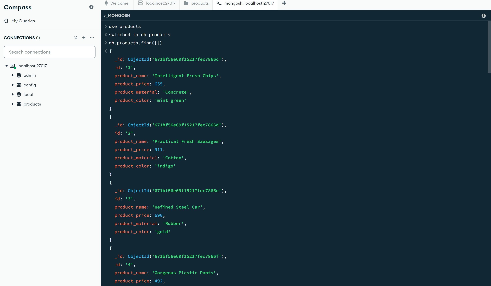
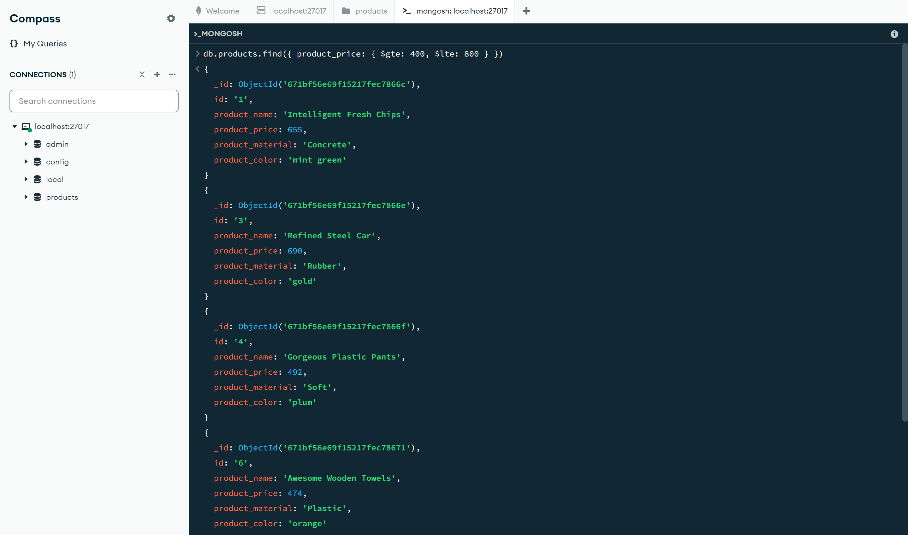
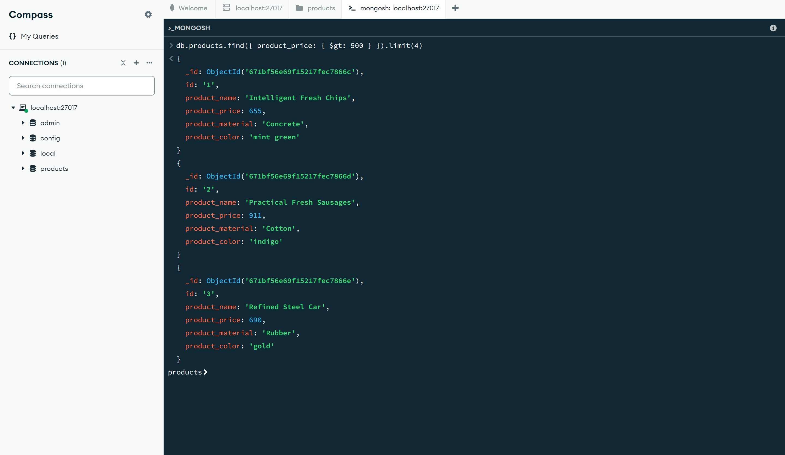
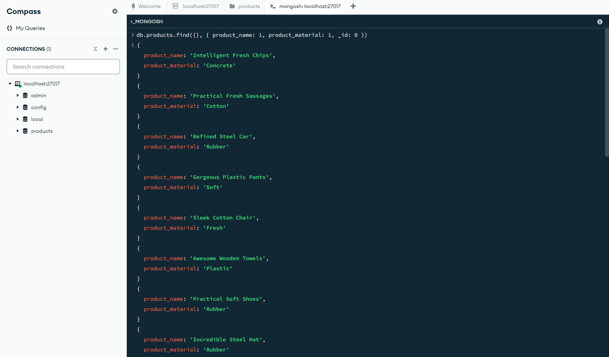
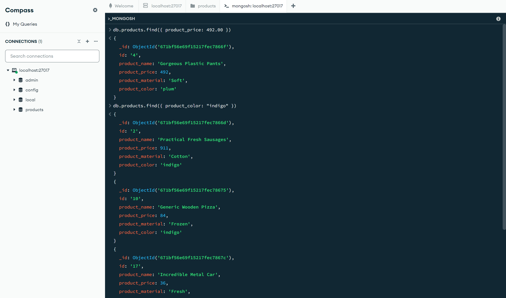
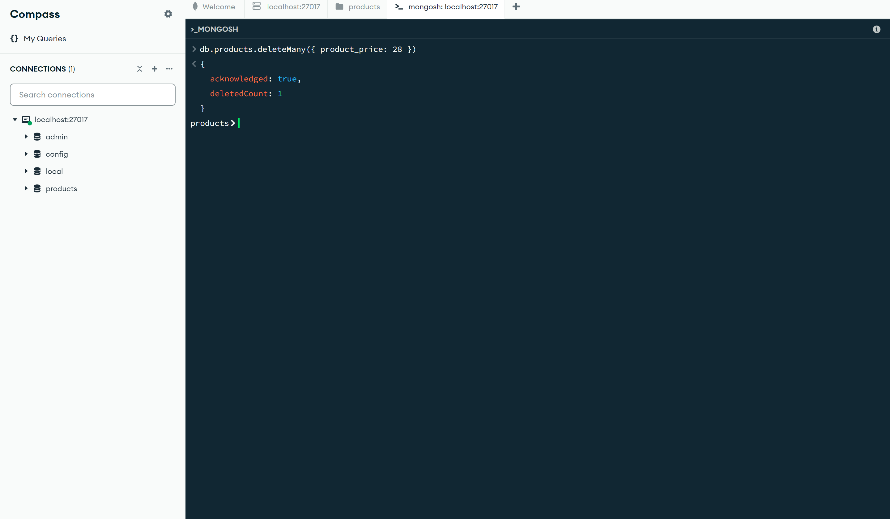

# MongoDB Query Operations

## Queries

### 1. Find all the information about each product
```javascript
db.products.find({})
```
  

### 2. Find the product prices that are between 400 and 800
```javascript
db.products.find({ product_price: { $gte: 400, $lte: 800 } })
```
 

### 3. Find the product prices that are not between 400 and 600
```javascript
db.products.find({ product_price: { $not: { $gte: 400, $lte: 600 } } })
```
 

### 4. List the four products that have a price greater than 500
```javascript
db.products.find({ product_price: { $gt: 500 } }).limit(4)
```
 

### 5. Find the product name and product material of each product
```javascript
db.products.find({}, { product_name: 1, product_material: 1, _id: 0 })
```
 

### 6. Find the product with a row id of 10
```javascript
db.products.find({ id: "10" })
```
 

### 7. Find only the product name and product material
```javascript
db.products.find({}, { product_name: 1, product_material: 1, _id: 0 })
```
 

### 8. Find all products that contain "Soft" in product material
```javascript
db.products.find({ product_material: "Soft" })
```
 

### 9. Find products that have product color "indigo" and product price 492.00
```javascript
db.products.find({ product_color: "indigo", product_price: 492.00 })
```
 

### 10. Delete products with a product price value of 28
```javascript
db.products.deleteMany({ product_price: 28 })
```
 

